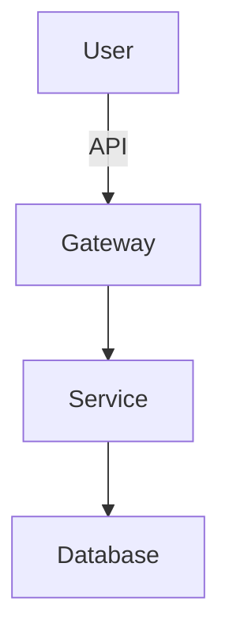

# 技术架构设计文档 (TDD)

**版本号**: 1.1
**作者**: 
**日期**: 

## 1. 系统概览
### 1.1 总体架构图
[插入逻辑架构图，例如 PlantUML/Mermaid]

### 1.2 关键技术选型
| 层级 | 技术/框架 | 版本 | 选型理由 |
| :--- | :--- | :--- | :--- |
| 前端 | Flutter | 3.19+ | 跨平台高性能 |
| 后端 | Cloudflare Workers | - | 无服务器、低延迟 |
| 存储 | Cloudflare R2 | - | 对象存储、无出口流量费 |
| 数据库 | D1 (SQLite) | - | 边缘存储、低成本 |

## 2. 模块设计
### 2.1 连接模块
- **功能**: 服务端配置、健康检查、API Key 验证
- **接口**: /health, /sync
- **数据流**: App -> Gateway (Check Key) -> Service

### 2.2 阅读进度同步模块 (Progress Sync)
- **定位一致性**:
  - **EPUB**: 采用 `EPUB CFI (Canonical Fragment Identifier)` 标准。记录当前屏幕顶部第一个完整段落的 DOM 路径 + 字符偏移量。无论设备屏幕大小，CFI 始终指向同一文本位置。
  - **TXT**: 采用 `Anchor Hash`。记录当前段落的前 30 个字符作为锚点。在不同设备上渲染时，先定位章节，再全文搜索匹配该锚点，计算出新的 `scroll_offset`。
- **数据流**: 
  1. `ReaderWidget` 渲染完成 -> 计算当前视口 CFI/Anchor -> `ProgressRepository`
  2. `ProgressRepository` -> 写入 `LocalDB` (标记 `is_synced=false`)
  3. `SyncService` 监听网络 -> 检测到 `is_synced=false` -> 调用 `Cloudflare Worker`
  4. `Worker` 校验时间戳 -> 返回 `latest_progress` -> 更新 `LocalDB`

### 2.3 书籍管理模块 (Book Management)
- **功能**: 书籍上传、元数据管理、文件存储、书籍下载
- **流程**:
  - **上传**: Client (Select File & Parse Metadata) -> Worker (Multipart Upload) -> Stream to R2 -> Save Metadata to D1 -> Return Book ID.
  - **下载**: Client (Request Download) -> Worker (Verify Key) -> Generate R2 Presigned URL / Stream Content -> Client.
  - **删除**: Client (Delete Request) -> Worker -> Delete R2 Object -> Delete D1 Record.

### 2.4 安全与异常处理
- **加密**: 进度数据在传输前使用 AES-256 加密，Key 为用户设置的 API Key。
- **异常检测**: 若检测到进度回滚超过 50% 且无明确操作，弹窗确认。

## 3. 数据设计
### 3.1 数据库ER图
[插入ER图]

### 3.2 关键表结构
| 表名 | 说明 |
| :--- | :--- |
| books | 书籍元数据 (Title, Author, R2 Key, Format) |
| progress | 阅读进度 (CFI, Anchor, Timestamp, DeviceID) |

## 4. 接口规范
- **协议**: HTTPS + JSON
- **鉴权**: X-API-Key: <your_secret_key>
- **版本**: /v1/resource

## 5. 部署架构
- **环境**: Production / Staging
- **CI/CD**: GitHub Actions -> Cloudflare Pages
- **监控**: Sentry (前端), Cloudflare Analytics (后端)

## 6. 安全设计
- **传输安全**: TLS 1.3
- **数据安全**: 敏感字段加密 (AES-256)
- **访问控制**: API Key 鉴权 (Single User)
