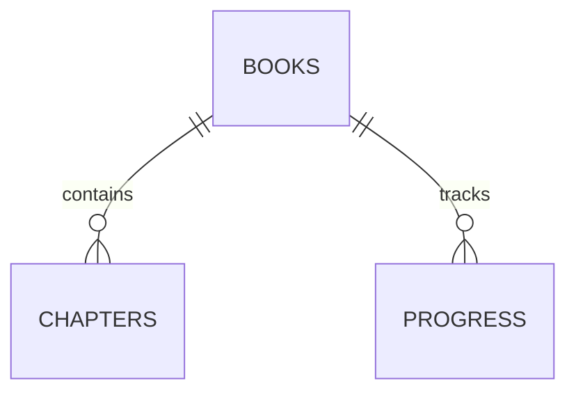

# 数据库设计文档 (DBD)

**版本号**: 1.1
**作者**: 
**日期**: 
**数据库**: Cloudflare D1 (SQLite)

## 1. 概述
### 1.1 命名规范
- **表名**: 小写下划线 (snake_case)，复数形式 (e.g., `users`, `books`)
- **字段名**: 小写下划线 (snake_case)
- **主键**: `id` (INTEGER PRIMARY KEY AUTOINCREMENT)
- **外键**: `table_id` (e.g., `user_id`)
- **索引**: `idx_table_column`

## 2. 实体关系图 (ERD)
[插入 ER Diagram]

## 3. 表结构设计
### 3.1 (已移除 Users 表，改为单用户)

### 3.2 书籍表 (books)
| 字段名 | 类型 | 必填 | 默认值 | 描述 |
| :--- | :--- | :--- | :--- | :--- |
| id | INTEGER | Yes | PK, Auto | 书籍ID |
| title | TEXT | Yes | - | 书名 |
| author | TEXT | No | 'Unknown' | 作者 |
| description | TEXT | No | - | 书籍简介 |
| cover_url | TEXT | No | - | 封面图片地址 (R2 URL) |
| file_path | TEXT | Yes | - | 文件存储路径 (R2 Key) |
| format | TEXT | Yes | 'epub' | 文件格式 (epub, txt) |
| file_size | INTEGER | Yes | 0 | 文件大小 (Bytes) |
| md5 | TEXT | No | - | 文件MD5校验和 (去重) |
| created_at | INTEGER | Yes | CurrentTime | 导入时间 |
| updated_at | INTEGER | Yes | CurrentTime | 更新时间 |

- **索引**:
  - `idx_books_title` (title)
  - `idx_books_updated` (updated_at)
  - `idx_books_md5` (md5)

### 3.3 阅读进度表 (progress)
| 字段名 | 类型 | 必填 | 默认值 | 描述 |
| :--- | :--- | :--- | :--- | :--- |
| id | INTEGER | Yes | PK, Auto | 进度ID |
| book_id | INTEGER | Yes | FK | 书籍ID |
| device_id | TEXT | Yes | - | 设备ID (UUID) |
| chapter_idx | INTEGER | Yes | 0 | 章节索引 |
| cfi | TEXT | No | - | EPUB: 标准 CFI 字符串 |
| anchor_text | TEXT | No | - | TXT: 锚点文本哈希 (前30字符) |
| percentage | REAL | Yes | 0.0 | 阅读百分比 (辅助显示) |
| timestamp | INTEGER | Yes | CurrentTime | 阅读时间戳 (ms) |
| is_synced | BOOLEAN | Yes | FALSE | 本地标记 |
| encrypted_data | TEXT | No | - | 云端加密数据 |

- **索引**:
  - `idx_progress_book` (book_id)
  - `idx_progress_synced` (is_synced)

## 4. 变更记录 (Changelog)
| 版本 | 日期 | 作者 | 变更内容 | SQL Script |
| :--- | :--- | :--- | :--- | :--- |
| v1.0 | 2026-02-27 | Admin | 初始化Schema | `init_schema.sql` |
| v1.1 | 2026-02-27 | Admin | 完善书籍表字段 | `alter_books.sql` |
